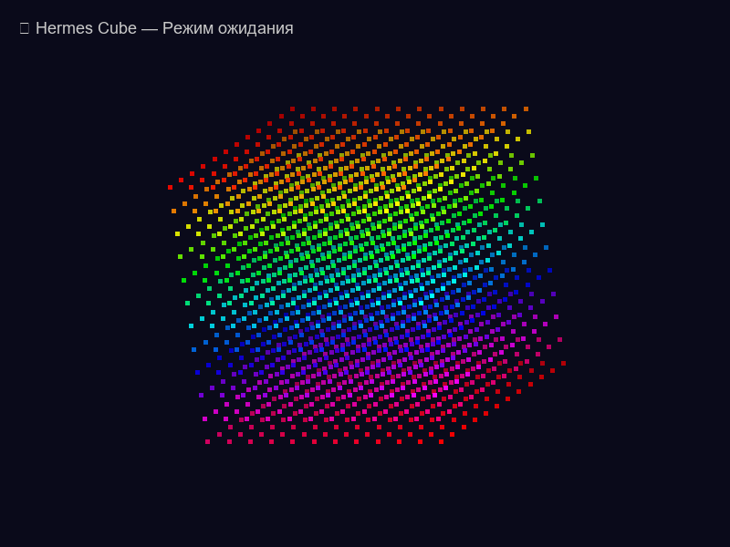
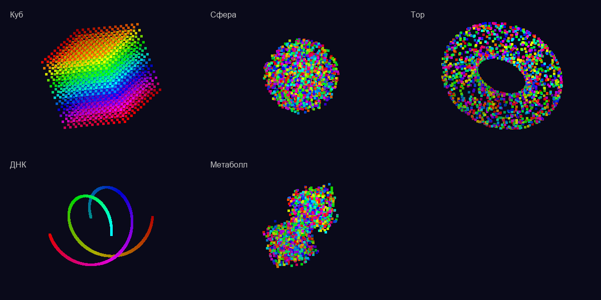
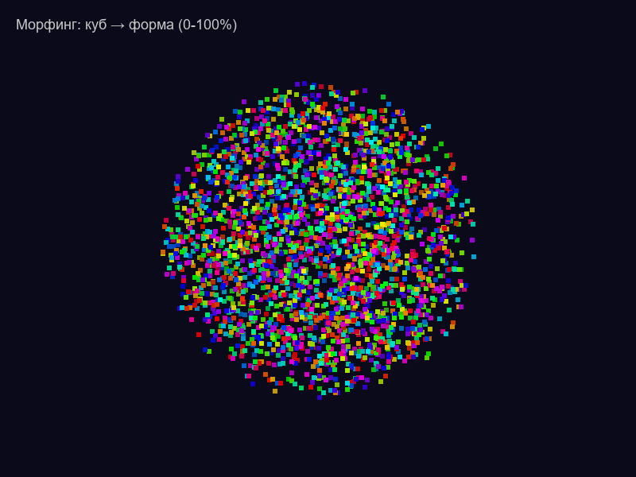
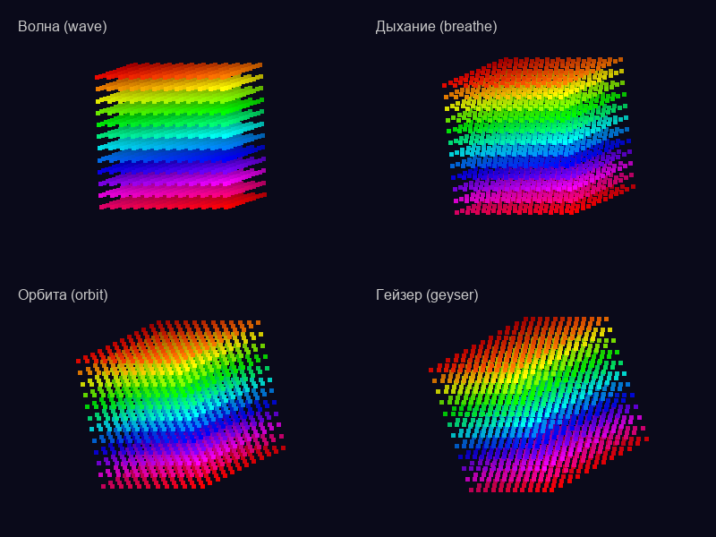
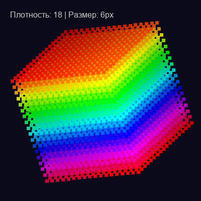
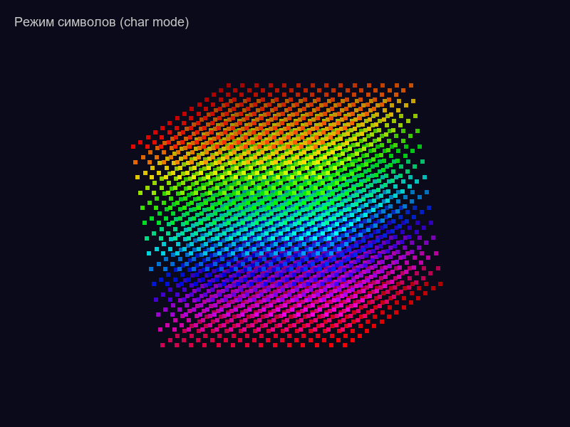
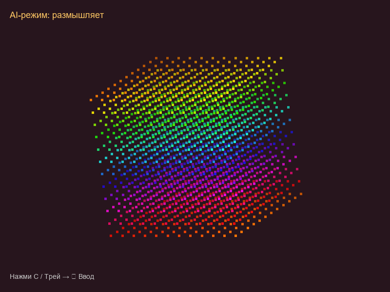
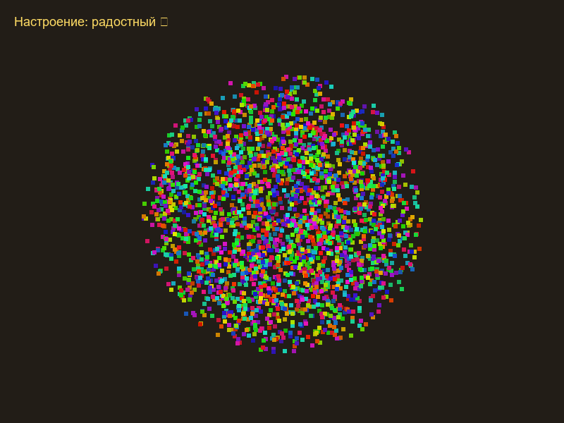
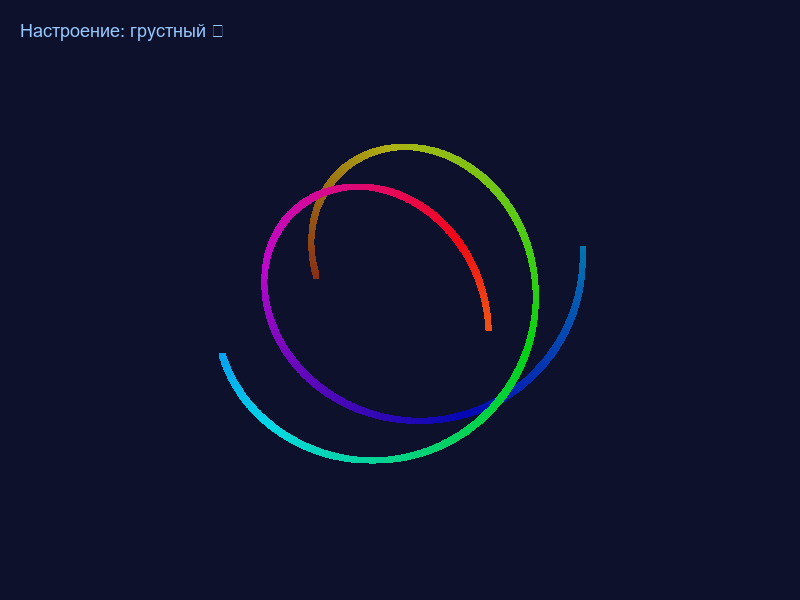
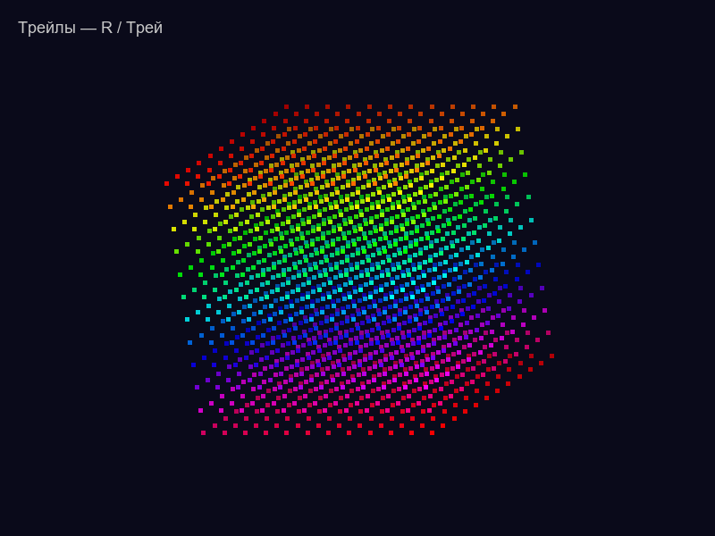

# ♢ Hermes Cube

Десктопный аватар-куб из частиц на прозрачном фоне. Работает как overlay поверх всех окон на Windows. Умеет общаться через локальную LLM (LM Studio).

## ✨ Возможности

- **3D-куб из частиц** с RGB-градиентом, глубиной и вращением по 3 осям
- **5 форм** — cube, sphere, torus, dna, metaball с плавным морфингом между ними
- **5 анимаций частиц** — wave, breathe, orbit, geyser, off
- **AI-общение** — встроенный чат с LM Studio (локальная LLM), авто-запуск при необходимости
- **Настроение** — ответ AI влияет на пульсацию, скорость вращения и цвет куба
- **Парящие буквы** — ответ AI вылетает буквами из центра куба
- **Прозрачный фон** — виден только куб (WS_EX_TRANSPARENT / transparentcolor)
- **Перетаскивание** — клавиша `T` переключает режим drag, выпуклая оболочка вокруг куба
- **Real-time настройки** — клавиша `s` или ПКМ → все параметры с прокруткой
- **Системный трей** — меню с AI-вводом, настройками, трейлами, выходом
- **PixelGrid** — пиксельный framebuffer для агентов (клавиша `G`)
- **Агенты** — пиксельные частицы-агенты с ролями (клавиша `A`)
- **Char mode** — поверхность куба из символов/symbols/words/glow
- **Трейлы** — шлейф из предыдущих положений куба
- **Single-instance lock** — предотвращает запуск второго экземпляра
- **Конфиг** — сохраняется в JSON, автозагрузка при старте

## 🎬 Демо


*Куб в режиме ожидания — 64×64 частицы с RGB-градиентом*


*Куб, Сфера, Тор, ДНК, Метаболл — переключение в реальном времени*


*Плавный морфинг между формами (0-100%)*


*4 режима: волна, дыхание, орбита, гейзер*


*Настройка плотности и размера частиц*


*Поверхность из символов вместо точек*


*Общение с AI через LM Studio — нажми C или выбери в трее*


*Ответ AI меняет пульсацию, скорость вращения и цвет куба*


*HSV-сдвиг цвета под настроение модели*


*Шлейф из предыдущих положений куба (R / трей)*

## ⚙️ Горячие клавиши

| Клавиша | Действие |
|---------|----------|
| `s` | Открыть настройки |
| `c` / `C` | Открыть AI-ввод |
| `t` / `T` | Переключить перетаскивание |
| `r` / `R` | Вкл/выкл трейлы (шлейф) |
| `g` / `G` | Вкл/выкл PixelGrid |
| `a` / `A` | Создать агента |
| `Esc` / `q` / `h` | Скрыть окно |
| ЛКМ + тащить | Переместить куб (в режиме drag) |
| ПКМ | Контекстное меню |
| Трей | AI-ввод, настройки, трейлы, выход |

## 🛠 Настройки (клавиша `s`)

| Параметр | По умолчанию | Диапазон | Описание |
|----------|-------------|----------|----------|
| Размер куба | 0.27 | 0.08 – 0.6 | Общий масштаб |
| Скорость вращения | 0.28 | 0.05 – 1.0 | Вращение по 3 осям |
| Частота пульсации | 1.8 | 0.3 – 5.0 | Пульсация размера |
| Амплитуда пульсации | 0.12 | 0.0 – 0.35 | Сила пульсации |
| Плотность частиц | 12 | 6 – 20 | Частиц на грань |
| Размер частицы | 6 | 2 – 12 | Размер в px |
| Пресет формы | cube | cube/sphere/torus/dna/metaball | Форма (реал-тайм) |
| Морфинг | 0% | 0% – 100% | Плавный переход куба → форма |
| Форма частиц | square | square/circle/dot | Как выглядит частица |
| Анимация | off | off/wave/breathe/orbit/geyser | Движение частиц |
| Скорость анимации | 1.5 | 0.3 – 5.0 | Множитель скорости |
| Амплитуда анимации | 0.12 | 0.0 – 0.5 | Сила смещения частиц |
| Поверх всех окон | да | да/нет | Overlay-режим |
| Char mode | dots | dots/symbols/words/glow | Символьный режим |

## 🤖 AI-интеграция

Куб общается через **LM Studio** (локальный сервер на `127.0.0.1:1234`).

**Как работает:**
1. Нажать `C` (или трей → 💬 Ввод)
2. Появляется окно ввода внизу экрана
3. Написать сообщение → Enter
4. **Если LM Studio не запущена** — куб сам запускает её (без окна терминала)
5. **Если модель не загружена** — куб загружает `gemma-4-e4b-it` через API
6. После готовности — запрос уходит, куб ждёт ответ
7. AI отвечает JSON-объектом с mood/text/color_hue
8. **Настроение** AI меняет пульсацию, скорость вращения и цвет куба
9. Ответ вылетает буквами из центра куба (парящие частицы)

**Формат ответа модели:**
```json
{"mood": "happy|sad|thinking|speaking|idle", "text": "ответ...", "color_hue": 0.0-1.0}
```

**Модель по умолчанию:** `lmstudio-community/gemma-4-E4B-it-GGUF`

**Системный промпт:** куб представляется как живой аватар, отвечает кратко (2-3 предложения), эмоционально.

## 🚀 Установка

### Из исходников (Python)

```bash
git clone https://github.com/kirarud/hermes-cube.git
cd hermes-cube

# Установка зависимостей
pip install numpy pillow pystray

# Запуск
python cube_app.py
```

### Portable .exe

Скачай `HermesCube.exe` из [Releases](https://github.com/kirarud/hermes-cube/releases) — запускай из любой папки.

## 🏗 Сборка .exe

```bash
pip install pyinstaller
pyinstaller --onefile --windowed \
  --collect-all pystray --collect-all PIL --collect-all numpy \
  --hidden-import=pystray._win32 --hidden-import=PIL._tkinter_finder \
  --name HermesCube cube_app.py
```

## 📦 Структура проекта

```
hermes-cube/
├── cube_app.py              # Основное приложение (~1800 строк)
├── ai_module.py             # AI-ядро: LM Studio, чат, настроение (~470 строк)
├── cube_agents.py           # Агенты: роли, поведение (~360 строк)
├── particle_agents.py       # ParticleAgent — частица-агент (~270 строк)
├── char_cube.py             # Символьный куб (~106 строк)
├── obsidian_graph.py        # Визуализация Obsidian-графа (~525 строк)
├── spatial_depth.py         # Spatial Depth Workspace (~192 строк)
├── pixel_grid.py            # Пиксельная сетка для агентов (~453 строк)
├── cube_agent_demo.py       # Демонстрация агентов (~83 строки)
├── installer.py             # Инсталлятор/установщик (~283 строки)
├── dist/                    # Сборки .exe
│   ├── HermesCube.exe
│   └── HermesCubeSetup.exe
├── docs/                    # Документация
└── screenshots/             # Скриншоты
```

## 🔧 Требования

- **ОС:** Windows 10/11
- **Python:** 3.11+ (для запуска из исходников)
- **AI:** LM Studio с gemma-4-e4b-it (загружается автоматически, необязательно)

## 📄 Лицензия

MIT
